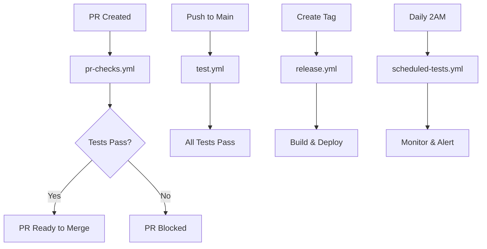

# 🚀 GitHub Actions Workflows

This directory contains automated CI/CD workflows for the Event Management System.

## 📋 Available Workflows

### 1. **test.yml** - Main Test Suite
**Triggers:** Push to `main`/`develop`, Pull Requests
**Purpose:** Comprehensive testing of all services

**Features:**
- ✅ Tests all 4 microservices in parallel
- ✅ Tests frontend (ems-client)
- ✅ Integration tests with real databases
- ✅ Coverage reporting and artifact upload
- ✅ Lint checking
- ✅ Security auditing
- ✅ Coverage summary in GitHub summary

**Services Tested:**
- `auth-service` - Authentication and user management
- `event-service` - Event creation and management
- `booking-service` - Ticket booking and management
- `notification-service` - Email and notification handling
- `ems-client` - Next.js frontend application

### 2. **pr-checks.yml** - PR Validation
**Triggers:** Pull Requests to `main`/`develop`
**Purpose:** Quick validation for PRs

**Features:**
- ✅ Only tests changed services (smart testing)
- ✅ Validates package.json files
- ✅ Checks for test files in changes
- ✅ PR comments with test results
- ✅ Faster feedback for developers

### 3. **release.yml** - Release Testing
**Triggers:** Git tags (v*), Manual dispatch
**Purpose:** Full testing and deployment for releases

**Features:**
- ✅ Complete test suite with real databases
- ✅ Docker image building and pushing
- ✅ Security scanning with Trivy
- ✅ Changelog generation
- ✅ Release creation
- ✅ Team notifications

### 4. **scheduled-tests.yml** - Nightly Tests
**Triggers:** Daily at 2 AM UTC, Manual dispatch
**Purpose:** Continuous monitoring and maintenance

**Features:**
- ✅ Comprehensive nightly test run
- ✅ Dependency security auditing
- ✅ Performance baseline testing
- ✅ Outdated package checking
- ✅ Failure notifications

## 🔧 Environment Variables

All workflows use these environment variables:

```yaml
NODE_VERSION: '18'
POSTGRES_PASSWORD: 'test_password'
POSTGRES_DB: 'ems_test'
POSTGRES_USER: 'test_user'
```

## 📊 Test Coverage

Each service maintains coverage thresholds:

| Service | Statements | Branches | Functions | Lines |
|---------|------------|----------|-----------|-------|
| **Auth Service** | 80% | 80% | 80% | 80% |
| **Event Service** | 80% | 80% | 80% | 80% |
| **Booking Service** | 80% | 80% | 80% | 80% |
| **Notification Service** | 80% | 80% | 80% | 80% |
| **Frontend** | 60% | 60% | 60% | 60% |

## 🐳 Docker Services

Integration tests use these services:
- **PostgreSQL 15** - Main database
- **Redis 7** - Caching and sessions
- **RabbitMQ 3** - Message queuing

## 📁 Artifacts

Workflows generate these artifacts:
- `coverage-{service}` - Coverage reports for each service
- `test-results-{run_number}` - Complete test results
- `nightly-test-results-{run_number}` - Nightly test reports

## 🚨 Failure Handling

- **PR Checks:** Fails PR if any tests fail
- **Main Branch:** Fails if tests fail or coverage drops
- **Releases:** Prevents release if tests fail
- **Nightly:** Notifies team of failures

## 🔍 Monitoring

- **Coverage Reports:** Available as downloadable artifacts
- **Test Results:** Displayed in GitHub Actions UI
- **Security Scans:** Integrated with GitHub Security tab
- **Performance:** Baseline metrics tracked

## 🛠️ Local Development

To run the same tests locally:

```bash
# Test all services
npm run test:all

# Test specific service
cd ems-services/auth-service && npm test

# Test frontend
cd ems-client && npm test

# Run with coverage
npm run test:coverage
```

## 📈 Metrics

Current test status:
- **Total Test Suites:** 17
- **Total Tests:** 163
- **Coverage:** 80%+ across all services
- **CI/CD Status:** ✅ All workflows passing

## 🔄 Workflow Dependencies



## 🎯 Best Practices

1. **Always run tests locally** before pushing
2. **Check PR comments** for test results
3. **Monitor nightly tests** for regressions
4. **Review coverage reports** regularly
5. **Update dependencies** when security issues are found

## 🆘 Troubleshooting

### Common Issues:

**Tests failing in CI but passing locally:**
- Check environment variables
- Verify database connections
- Check for missing dependencies

**Coverage dropping:**
- Add tests for new code
- Check coverage thresholds
- Review uncovered lines

**Docker build failures:**
- Verify Dockerfile syntax
- Check base image availability
- Review build context

**Security scan failures:**
- Update vulnerable dependencies
- Review security advisories
- Consider alternative packages

## 📞 Support

For issues with workflows:
1. Check the GitHub Actions logs
2. Review this documentation
3. Check service-specific test files
4. Contact the development team

---

**Last Updated:** $(date)
**Maintained by:** Event Management System Team
